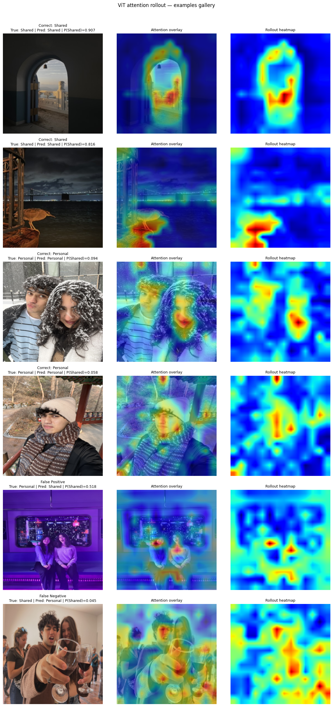

<div align="center">


# Would I Instagram This?

**Teaching a model my photo-sharing aesthetic — and making it explain itself.**


### 📄 &nbsp;[**Read the full paper →**](paper/would-i-instagram-this-paper.pdf)

</div>

---

I have ~300 photographs that split into two piles: the ones I posted to Instagram, and the ones I kept. Nobody told me the rule — but the rule exists, and I apply it in under a second every time.

So I tried to learn it. Three iterations, four models, one constraint that shaped all of them: **a model that predicts my taste but can't explain itself hasn't taught me anything about my taste.** Accuracy was never the point. Legibility was.

<p align="center"></p>
<p align="center"><sub>Attention rollout on the fine-tuned ViT. On photos I shared, attention locks onto <b>compositional anchors</b> — the sunlit pillar of an archway, a bridge, a horizon. On photos I kept, it locks onto <b>faces</b>. Different in kind, not just location.</sub></p>

## Results

All models on one identical 60-image held-out test set (30 shared / 30 personal).

| Model | Representation | Test acc. | AUC | Explains itself? |
|---|---|:---:|:---:|:---:|
| Handcrafted LR | 13 pixel statistics | 0.783 | 0.837 | ✅ coefficients |
| CNN + SVM (RBF) | 512-d frozen ResNet-18 | 0.817 | 0.893 | ❌ |
| Caption LR | 384-d MiniLM over BLIP captions | 0.750 | 0.752 | ✅✅ **plain English** |
| **Fine-tuned ViT** | raw pixels, 196 patches | **0.833** | **0.900** | ✅✅ **attention maps** |
| *CLIP + LR (reference)* | *512-d CLIP* | *0.883* | *0.946* | *❌* |

**The finding:** my sharing decisions need *both* layers. The subject has to be the right kind of thing — scenic, environmental, deliberately composed — and then the exposure has to be pulled down with a compositional anchor in frame. Models reaching only one layer fail in exactly the way the theory predicts. Captions find the right subjects but miss the execution (0.750). Pixel statistics find the aesthetic signature but have no idea what the photo is *of* (0.783).

Nothing here beat the opaque CLIP baseline. But the pipeline made CLIP's black box legible: we now know **where** the model looks and **what** it reads as most and least shareable. That was the point.

## Three iterations

| | Question | Approach | Result |
|---|---|---|---|
| **I** | Can pixel statistics predict taste? | 13 handcrafted features → LR, Naive Bayes, from-scratch LR | 0.783 — it learned my *exposure* signature, not my subjects |
| **II** | Can learned visual features close the gap? | Frozen + fine-tuned ResNet-18, SVM-RBF, CLIP zero-shot | 0.817–0.883 — better, but nothing explains itself |
| **III** | Can it explain itself? | BLIP→MiniLM captions, fine-tuned ViT-B/16 + attention rollout | 0.833 — and for the first time, *readable* |

Each notebook is the complete pipeline for that iteration, with every figure and printed result preserved inline:

- **[`iteration-1-pixel-statistics.ipynb`](notebooks/iteration-1-pixel-statistics.ipynb)**
- **[`iteration-2-learned-visual-features.ipynb`](notebooks/iteration-2-learned-visual-features.ipynb)**
- **[`iteration-3-captions-and-attention.ipynb`](notebooks/iteration-3-captions-and-attention.ipynb)**

<sub>A note on one number: Iteration I's own notebook reports **0.800** for the handcrafted model. The **0.783** used here and in the paper is the value after that pipeline was re-run on the identical split in Iteration II, and it is the figure carried forward through every later comparison.</sub>

## Repository

```
├── paper/        the full write-up — start here
├── notebooks/    complete pipelines, all outputs preserved
├── figures/      result figures extracted from the notebooks
└── requirements.txt
```

## Running it

Written for Google Colab with a T4 GPU; a full run is ~25–35 min, dominated by BLIP captioning and ViT fine-tuning.

```bash
git clone https://github.com/rayyanmaan/would-i-instagram-this.git
cd would-i-instagram-this && pip install -r requirements.txt
```

The 300 source photographs are personal and aren't in this repo — but every figure and printed result is preserved in the committed notebooks, so the analysis reads end to end without them. To run it on your own photos, point the two directory constants at your own folders:

```python
SHARED_DIR   = '.../photos_for_ml/shared/'    # y = 1
PERSONAL_DIR = '.../photos_for_ml/personal/'  # y = 0
```

## A note on scope

This model learns **my** behaviour — not any objective standard of image quality. Every label reflects my own visual culture and an editing style built over years of posting. Everyone whose face appears consented to being photographed. Using something like this to rank other people's photos without their input would impose one subjective aesthetic as if it were ground truth. Full discussion in the paper.

<div align="center"><sub>

**Rayyan Afzal** · [@rayyanmaan](https://github.com/rayyanmaan)

</sub></div>
